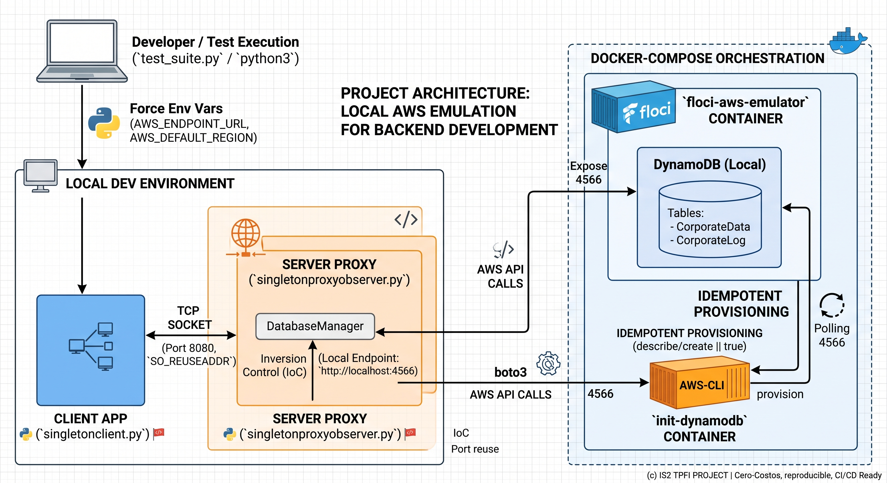
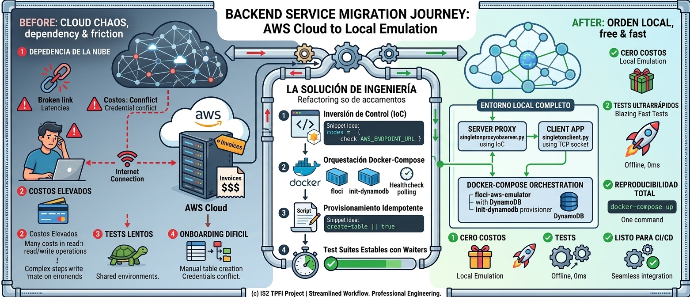

#  Arquitectura AWS Python

Proyecto que implementa patrones de diseño (Singleton, Observer, Proxy) en un servidor Python con AWS DynamoDB.

## Estructura del Proyecto

```
TPFI_IS2/
├── components/
│   ├── client/
│   │   ├── __init__.py
│   │   ├── singletonclient.py     # Cliente Singleton para operaciones get/set/list
│   │   └── observerclient.py      # Cliente Observer para recibir notificaciones
│   └── server/
│       ├── __init__.py
│       ├── singletonproxyobserver.py  # Servidor principal (main)
│       └── core/                  # Módulo para las clases de patrones
│           ├── __init__.py
│           ├── db_manager.py      # Implementa el patrón Singleton
│           └── subscription_manager.py # Implementa el patrón Observer
├── inputs/
│   ├── input_valid_get.json
│   ├── input_valid_set.json
│   └── input_valid_list.json
├── .gitignore                     # Ignora logs, outputs y credenciales
└── requirements.txt               # Dependencias (boto3, etc.)
```
## Arquitectura del Sistema



## Instalación

1. Crear un entorno virtual:
```bash
python3 -m venv venv
source venv/bin/activate  # En Linux/Mac
```

2. Instalar dependencias:
```bash
pip install -r requirements.txt
```

3. Configurar AWS CLI con tus credenciales:
```bash
aws configure
```

## Uso

### Iniciar el Servidor

```bash
cd components/server
python singletonproxyobserver.py -p 8080 -v
```

### Ejecutar Cliente Singleton

#### Operación GET:
```bash
cd components/client
python singletonclient.py -i ../../inputs/input_valid_get.json -v
```

#### Operación SET:
```bash
python singletonclient.py -i ../../inputs/input_valid_set.json -o output_set.json -v
```

#### Operación LIST:
```bash
python singletonclient.py -i ../../inputs/input_valid_list.json -v
```

### Ejecutar Cliente Observer

```bash
python observerclient.py -s localhost -p 8080 -o observer_output.json -v
```

## Descripción de Componentes

### Servidor (singletonproxyobserver.py)
- Implementa tres patrones de diseño:
  - **Singleton**: Una única instancia de `DatabaseManager` para acceder a DynamoDB
  - **Observer**: Gestión de suscripciones y notificaciones
  - **Proxy**: Intercepta operaciones SET y notifica a observadores

### Clientes
- **SingletonClient**: Opera con AWS DynamoDB mediante operaciones get/set/list
- **ObserverClient**: Se suscribe a notificaciones de cambios en la base de datos

### Tablas DynamoDB
- `CorporateData`: Almacena los datos corporativos
- `CorporateLog`: Registra todas las acciones realizadas

## Patrones de Diseño Implementados

1. **Singleton**: `DatabaseManager` asegura una única conexión a DynamoDB
2. **Observer**: `SubscriptionManager` gestiona suscripciones y notificaciones
3. **Proxy**: El servidor intercepta operaciones SET y propagan cambios

## Requisitos
- Python 3.7+
- AWS Account con DynamoDB habilitado
- Tablas `CorporateData` y `CorporateLog` creadas en DynamoDB


# arquitecturaAWS
# arquitecturaAWS

# Migración a Entorno de Emulación Local y Estabilización de Infraestructura

## 1. Resumen Ejecutivo
Para elevar los estándares de ingeniería del proyecto, aislar las pruebas de integración y eliminar la dependencia de servicios cloud facturables durante el desarrollo, se ejecutó una migración de la infraestructura de base de datos desde AWS Cloud hacia un entorno local efímero utilizando **Floci** (emulador de AWS). 

Esta refactorización transformó el proyecto de un script dependiente de la nube a una arquitectura lista para CI/CD, implementando Infraestructura como Código (IaC), Inyección de Dependencias y estrategias de resiliencia en la red.

## Proceso de Migración


---

## 2. Fases de Implementación y Desafíos Técnicos

### Fase 1: Desacoplamiento del SDK e Inyección de Dependencias
El objetivo inicial fue redirigir el tráfico del SDK (`boto3`) hacia el emulador local sin alterar la lógica de negocio del servidor.

*   **Implementación:** Se modificó el patrón Singleton del `DatabaseManager` para aceptar variables de entorno (`AWS_ENDPOINT_URL`).
*   **Incidencia (`NoRegionError`):** Durante las pruebas, el SDK de AWS falló al intentar inicializar el cliente de DynamoDB, incluso apuntando a `localhost`.
*   **Solución:** Se identificó que `boto3` requiere obligatoriamente una región configurada para construir el endpoint interno. Se inyectó la variable `AWS_DEFAULT_REGION='us-east-1'` en el entorno de ejecución de las pruebas, resolviendo el fallo y aislando completamente el SDK.

### Fase 2: Orquestación y Auto-provisionamiento Idempotente (Docker)
Para garantizar la reproducibilidad del entorno, se documentó la infraestructura utilizando `docker-compose.yml`. Se diseñó un servicio de auto-provisionamiento (`init-dynamodb`) responsable de crear las tablas necesarias al levantar el contenedor.

*   **Implementación:** Se configuró un contenedor con `aws-cli` que hace *polling* (espera activa) hasta que el emulador Floci está operativo, para luego ejecutar los comandos de creación de tablas.
*   **Incidencia (Syntax Error en YAML/Bash):** El intérprete de Bash del contenedor fallaba con un código de salida `Exited (2)` y el mensaje `unexpected end of file`. Esto fue causado por un conflicto en el formateo de saltos de línea y barras invertidas (`\`) entre YAML y Bash.
*   **Solución:** Se refactorizó el comando de inicialización a un *one-liner* continuo dentro de la directiva `command`. Además, para garantizar la **idempotencia** del script (capacidad de ejecutarse múltiples veces sin fallar si los recursos ya existen), se implementó el operador lógico `|| true` al final de las instrucciones de creación de tablas.

### Fase 3: Mitigación de Condiciones de Carrera (Race Conditions)
Al orquestar la suite de pruebas automatizadas contra la nueva infraestructura dockerizada, surgió un problema de sincronización.

*   **Incidencia (`ResourceNotFoundException`):** El script de pruebas (`test_suite.py`) fallaba intermitentemente al no encontrar la tabla `CorporateLog`. El script de Python se ejecutaba milisegundos más rápido que el contenedor de provisionamiento de Docker, intentando escanear una tabla que aún estaba en proceso de creación.
*   **Solución:** En lugar de ensuciar los tests con lógica de creación de infraestructura, se aplicó un patrón de espera pasiva utilizando los *waiters* nativos del SDK (`wait_until_exists()`). Esto obliga a la suite de pruebas a pausar su ejecución de manera inteligente hasta que Docker confirme que la infraestructura está lista y operativa.

### Fase 4: Resiliencia de Sockets TCP
Tras interrupciones abruptas durante la depuración de los tests, el servidor no podía volver a iniciarse.

*   **Incidencia (`[Errno 98] Address already in use`):** Las caídas inesperadas del proceso de testing impedían que se ejecutaran las rutinas de *teardown* (limpieza), dejando el puerto 8080 secuestrado en estado `TIME_WAIT` por el sistema operativo.
*   **Solución:** Se mejoró la robustez de la capa de red en el servidor proxy. Se inyectó la opción de socket `SO_REUSEADDR` (`server_socket.setsockopt(socket.SOL_SOCKET, socket.SO_REUSEADDR, 1)`), indicándole al kernel que el puerto puede ser reasignado inmediatamente en caso de reinicios forzados o caídas del proceso.

---

## 3. Conclusión
La arquitectura actual presenta un entorno de desarrollo **Cero-Costos**, **100% reproducible** y tolerante a fallos de sincronización. El sistema está formalmente preparado para ser integrado en pipelines de Integración Continua (ej. GitHub Actions), demostrando un control integral sobre el ciclo de vida del software, desde la infraestructura hasta la capa de red.